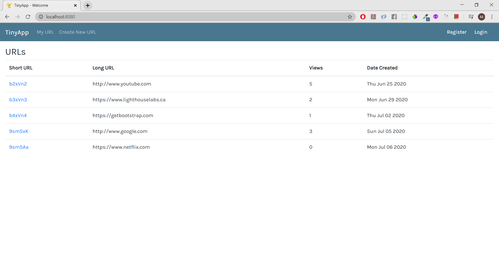
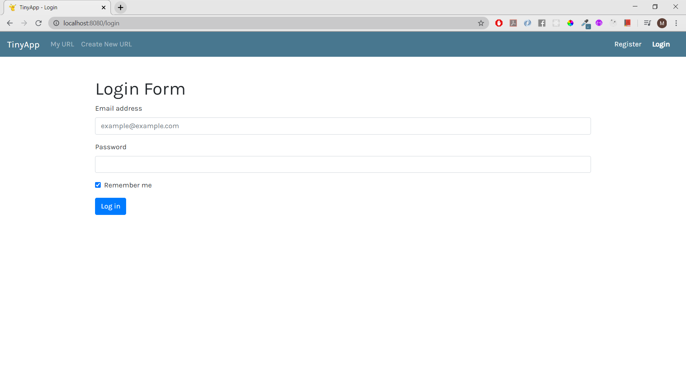
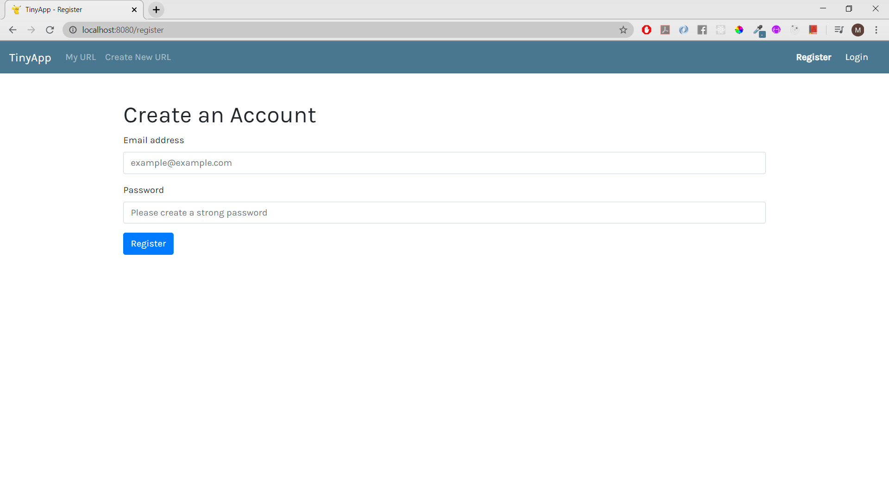
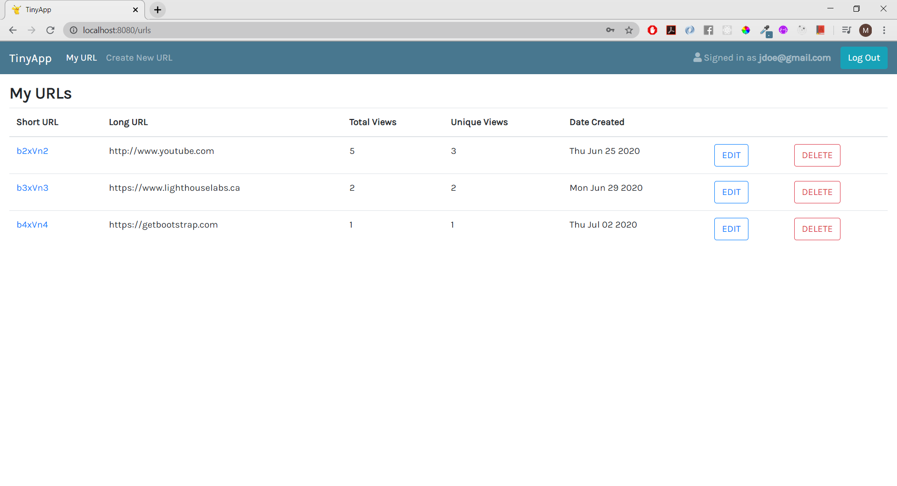
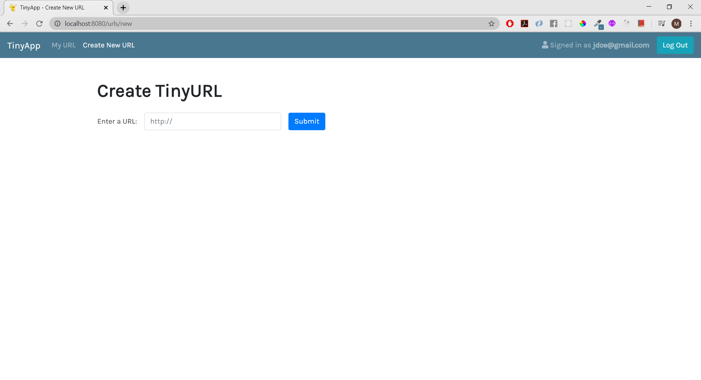
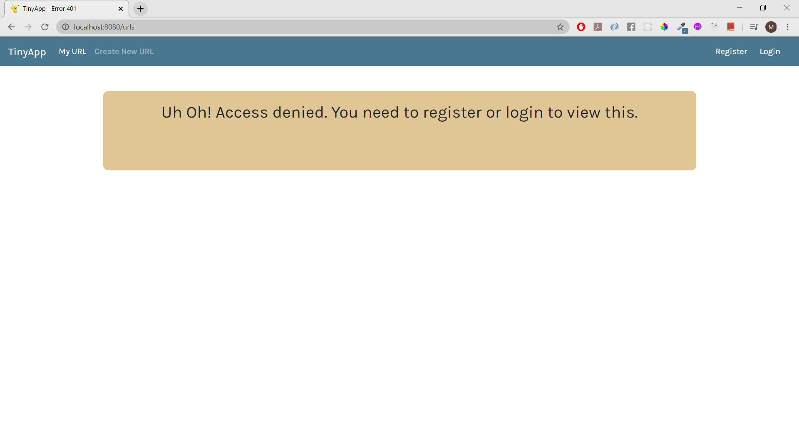
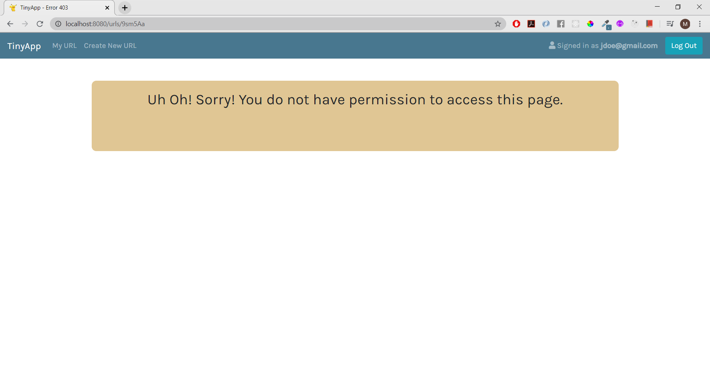
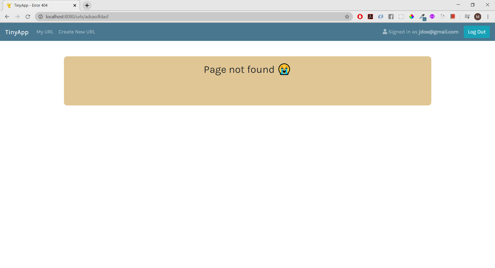
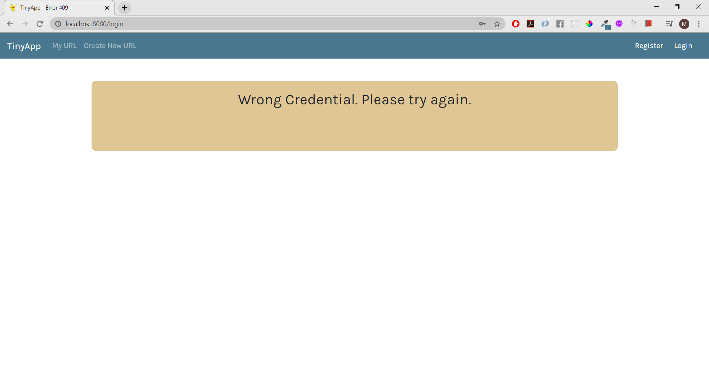

# TinyApp Project

TinyApp is a full stack web application built with Node and Express that allows users to shorten long URLs (à la bit.ly).

## Final Product

## Dependencies

- Node.js
- Express
- EJS
- uuid
- bcrypt
- body-parser
- cookie-parser
- cookie-session
- method-override

## Dev Dependencies
- chai
- mocha

## Getting Started

- Install all dependencies (using the `npm install` command).
- Run the development web server using the `node express_server.js` command.

### Troubleshooting
1. Make sure Express 4.16 is being utilized as this project did not use body-parser package but the built-in JSON middleware.
